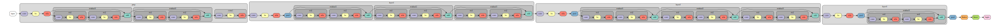

# Efficient-CIFAR-Series

A fork of [cifar10-fast](https://github.com/davidcpage/cifar10-fast) contains the code implementation of [NNI](https://github.com/microsoft/nni) hyperparametre tuning and architecture search experiments.




### Install 
NNI supports and is tested on Ubuntu >= 16.04, macOS >= 10.14.1, and Windows 10 >= 1809. Simply run the following `pip install` in an environment that has `python 64-bit >= 3.5`.

[NNI Experiment](https://github.com/microsoft/nni) Linux or macOS
```bash
python3 -m pip install --upgrade nni
```

PyTorch 1.6 Release torch.cuda.amp module: [Typical Mixed Precision Training](https://pytorch.org/docs/master/notes/amp_examples.html#amp-examples) 
```bash
pip install torchvision==0.7.0
pip install torch==1.6.0
```

应具有以下代码结构：

```
Efficient-CIFAR-Series
├── core.py
├── torch_backend.py
├── README.md
├── main.py                             超参搜索 & 模型结构验证
├── network.py                          字典网络定义
├── search_space.json                   定义超参搜索空间 
├── config_search.yml                   开启超参配置实验
├── data_cifar100                       数据集
├── notebook                            实验统计
│   ├── bag_of_tricks.ipynb
│   ├── batch_norm_post.ipynb
│   └── experiments.ipynb
└── architecture_search                 单路径 One-Shot-Cifar 超网训练
    ├── cifar_spos
    │   ├── __init__.py
    │   ├── evolution_cifar.py
    │   ├── trainer_cifar.py
    │   └── mutator_cifar.py
    ├── search_space_zoo
    │   ├── CELL
    │   ├── darts_example.py
    │   ├── darts_stack_cells.py
    │   ├── enas_macro_example.py
    │   ├── enas_micro_example.py
    │   └── utils.py
    ├── nni_auto_gen_search_space.json  导出网络结构
    ├── architecture_final.json
    ├── blocks.py
    ├── config_search_cifar.yml
    ├── dataloader.py
    ├── network.py
    ├── readme.md
    ├── scratch.py
    ├── supernet.py
    ├── tester.py
    ├── tuner.py
    ├── random_nas_tuner.py
    └── utils.py
    
```

### 1. Start HPO Experiment

Search space configuration: 
Then edit `search_space.json`, you can add the hyper-parameters as follows:
```
+-----------------+------------+-------------------------------------------------------------------------------+
| Name            | default    |                        Hyper-parameters                                       |
+-----------------+------------+-------------------------------------------------------------------------------+
| peak_lr         | 0.4        |    "peak_lr":{"_type": "loguniform", "_value": [4e-5, 4e-1]},                 |
+-----------------+------------+-------------------------------------------------------------------------------+
| base_wd         | 5e-4       |    "base_wd":{"_type": "loguniform", "_value": [5e-5, 5e-3]},                 |
+-----------------+------------+-------------------------------------------------------------------------------+
| logits_weight   | 0.125      |    "logits_weight":{"_type":"choice", "_value":[0.0625, 0.125, 0.25, 0.5, 1]},|
+-----------------+------------+-------------------------------------------------------------------------------+
| peak_epoch      | 5          |    "peak_epoch":{"_type":"choice", "_value":[5, 10, 15, 20]},                 |
+-----------------+------------+-------------------------------------------------------------------------------+
| cutout          | 8          |    "cutout":{"_type":"choice", "_value":[10, 8, 6, 4]},                       |
+-----------------+------------+-------------------------------------------------------------------------------+
| total_epoch     | 24         |    "total_epoch":{"_type":"choice", "_value":[24, 32, 40]}                    |
+-----------------+------------+-------------------------------------------------------------------------------+


```

Neural architecture tweak

```
+-----------------+------------+-------------------------------------------------------------------------------+
| Name            | default    |                        Architecture Hyper-parameters                                       |
+-----------------+------------+-------------------------------------------------------------------------------+
| prep            | 64         |    "prep":{"_type":"choice", "_value":[16, 32, 48, 64]},                      |
+-----------------+------------+-------------------------------------------------------------------------------+
| layer1          | 128        |    "layer1":{"_type":"choice", "_value":[64, 80, 96, 112, 128]},              |
+-----------------+------------+-------------------------------------------------------------------------------+
| layer2          | 256        |    "layer2":{"_type":"choice", "_value":[128, 160, 192, 224, 256]},           |
+-----------------+------------+-------------------------------------------------------------------------------+
| layer3          | 512        |    "layer3":{"_type":"choice", "_value":[256, 320, 384, 448, 512]}            |
+-----------------+------------+-------------------------------------------------------------------------------+
| extra_prep      | 0          |    "extra_prep":{"_type": "choice", "_value": [0, 1, 2, 3]},                  |
+-----------------+------------+-------------------------------------------------------------------------------+
| extra_layer1    | 0          |    "extra_layer1":{"_type": "choice", "_value": [0, 1, 2, 3]},                |
+-----------------+------------+-------------------------------------------------------------------------------+
| extra_layer2    | 0          |    "extra_layer2":{"_type": "choice", "_value": [0, 1, 2, 3]},                |
+-----------------+------------+-------------------------------------------------------------------------------+
| extra_layer3    | 0          |    "extra_layer3":{"_type": "choice", "_value": [0, 1, 2, 3]},                |
+-----------------+------------+-------------------------------------------------------------------------------+
| res_prep        | 0          |    "res_prep":{"_type": "choice", "_value": [0, 1, 2, 3]},                    |
+-----------------+------------+-------------------------------------------------------------------------------+
| res_layer1      | 1          |    "res_layer1":{"_type": "choice", "_value": [0, 1, 2, 3]},                  |
+-----------------+------------+-------------------------------------------------------------------------------+
| res_layer2      | 0          |    "res_layer2":{"_type": "choice", "_value": [0, 1, 2, 3]},                  |
+-----------------+------------+-------------------------------------------------------------------------------+
| res_layer3      | 1          |    "res_layer3":{"_type": "choice", "_value": [0, 1, 2, 3]}                   |
+-----------------+------------+-------------------------------------------------------------------------------+
```

Now you can use the TPE in experiment configuration file:

```yaml
tuner:
  builtinTunerName: TPE
  classArgs:
    #choice: maximize, minimize
    optimize_mode: maximize
```

端口:XXXX>1024

开启 Hyperparameter Optimization 实验，找到最好的超参组合，并且记录下来。
```bash
nnictl create --config config.yml --port XXXX 
```

浏览器打开
```bash
http://127.0.0.1:XXXX/detail
```

在metric拉不开差距的时候优先选择Duration小的trial


### 2. Start Train Supernet

查看超网的搜索空间

```text
1. example path options:
    choice_block = LayerChoice([
        ConvBnReluPool(inp, oup, stride=stride, k=3),
        ConvBnReluPool(inp, oup, stride=stride, k=5),
        ConvBnRelu(inp, oup, stride=stride, k=3),
        ConvBnRelu(inp, oup, stride=stride, k=5)
        ])
        
2. depth shortcut:
    self.input_switch = InputChoice(n_candidates=4,
                                    n_chosen=1,
                                    key='skip')
           
    skip_x = self.input_switch([zero_x, conv3_input, conv4_input, conv4_output]) 
```

训练超网权重

```bash
python supernet_cifar.py
```

save checkpoint 

```python
"../checkpoints/epoch_29.pth.tar"
```

断点训练 学习率重载 undone
```bash
python supernet_cifar.py --load-checkpoint --spos-preprocessing
```  


继承筛选 Search space shrinking


### 3. Search Best Architecture

生成 搜索空间待选 retrain bn

```bash
nnictl ss_gen -t "python tester_cifar.py"
```

启实验
```bash
nnictl create --config config_search_cifar.yml --port 7700

```

### 4. Train from Scratch

对于超网训练效果

```bash
python scratch.py
```


## Result

Basic network architecture: input_size=32, prep+ layer1->layer3 +maxpooling+ fc.
```text
resolution                                        :[32,    32->16,            16->8,             8->4         ,     4->1      ]
layers                                            :[prep,  layer1,            layer2,            layer3       ,     pooling   ]
basic component                                   :[conv3, conv3+pooling,     conv3+pooling,     conv3+pooling,     maxpooling]
```

Make network deeper and get better performance.
```text
1. without residual only extra: +conv             :[conv3, conv3+pooling       +[E],  conv3+pooling       +[E], conv3+pooling       +[E], maxpooling]

2. without residual only extra *3: +2conv         :[conv3, conv3+pooling      +[3E],  conv3+pooling      +[3E], conv3+pooling      +[3E], maxpooling]

3. with residual :  +shortcut                     :[conv3, conv3+pooling       +[R],  conv3+pooling       +[R], conv3+pooling       +[R], maxpooling]

4. residual(default=2) + extra: +conv             :[conv3, conv3+pooling+ [R]+  [E],  conv3+pooling+ [R]+  [E], conv3+pooling+ [R]+  [E], maxpooling]

5. the order between [R] and [E]: change chortcut :[conv3, conv3+pooling+ [E]+  [R],  conv3+pooling+ [E]+  [R], conv3+pooling+ [E]+  [R], maxpooling]

6. the order between [R] and [3R]: multi-shortcut :[conv3, conv3+pooling+ [E]+ [3R],  conv3+pooling+ [E]+ [3R], conv3+pooling+ [E]+ [3R], maxpooling]
```

Neural architecture tweak result.
```json
//78.01
{
    "peak_lr": 0.6499631190592446,
    "prep": 64,
    "layer1": 112,
    "layer2": 256,
    "layer3": 512,
    "extra_prep": 1,
    "extra_layer1": 0,
    "extra_layer2": 0,
    "extra_layer3": 0,
    "res_prep": 2,
    "res_layer1": 3,
    "res_layer2": 3,
    "res_layer3": 1
}

//78.16
{
    "peak_lr": 0.678478986324988,
    "prep": 64,
    "layer1": 112,
    "layer2": 256,
    "layer3": 512,
    "extra_prep": 0,
    "extra_layer1": 0,
    "extra_layer2": 0,
    "extra_layer3": 0,
    "res_prep": 3,
    "res_layer1": 3,
    "res_layer2": 3,
    "res_layer3": 1
}

```

Example layer assignment
```text
    input size :[32, 16, 8, 4]
    assignment :[ 2,  1, 1, 0] +
    
    [E]        :[ 1,  1, 1, 1] * [1, 0, 0, 0]
    [R]        :[ 2,  2, 2, 2] * [2, 3, 3, 1]
    final      :[ 7,  7, 7, 2]
    78.01_cifar100_7_7_7_2_e24_t210.49_logs.tsv
        
    [E]        :[ 1,  1, 1, 1] * [0, 0, 0, 0]
    [R]        :[ 2,  2, 2, 2] * [3, 3, 3, 1]
    final      :[ 8,  7, 7, 2]
    78.16_cifar100_8_7_7_2_e24_t220.94_logs.tsv
```

           